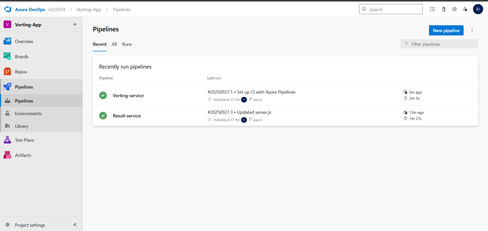

# Example Voting App - Azure DevOps CI/CD Pipeline

A simple distributed application running across multiple Docker containers with complete CI/CD implementation using Azure DevOps, Azure Kubernetes Service (AKS), and ArgoCD.

## Table of Contents
- [Overview](#overview)
- [Architecture](#architecture)
- [Getting Started](#getting-started)
- [Project Structure](#project-structure)
- [Prerequisites](#prerequisites)
- [Step-by-Step Implementation](#step-by-step-implementation)
- [Infrastructure Setup](#infrastructure-setup)
- [Continuous Integration (CI)](#continuous-integration-ci)
- [Continuous Deployment (CD)](#continuous-deployment-cd)
- [Application Components](#application-components)

## Overview

This project demonstrates a complete DevOps pipeline implementation featuring:
- **Continuous Integration (CI)** using Azure DevOps Pipelines
- **Continuous Deployment (CD)** using Azure Kubernetes Service (AKS) and ArgoCD
- **Multi-container application** with microservices architecture
- **Infrastructure as Code** practices
- **GitOps** deployment methodology

## Architecture

The application consists of multiple interconnected services:


*Figure 1: Complete application architecture showing all components and their interactions*

### Application Components:
- **Vote App (Python)**: Front-end web application for voting between two options
- **Redis**: In-memory data store for collecting new votes
- **Worker (.NET)**: Background service that consumes votes and stores them
- **PostgreSQL**: Database for persistent vote storage
- **Result App (Node.js)**: Real-time results dashboard

## Getting Started

### Local Development
Download [Docker Desktop](https://www.docker.com/products/docker-desktop) for Mac or Windows. [Docker Compose](https://docs.docker.com/compose) will be automatically installed. On Linux, make sure you have the latest version of [Compose](https://docs.docker.com/compose/install/).

Run in this directory to build and run the app:
```shell
docker compose up
```

The `vote` app will be running at [http://localhost:8080](http://localhost:8080), and the `results` will be at [http://localhost:8081](http://localhost:8081).

### Docker Swarm Deployment
If you want to run it on a [Docker Swarm](https://docs.docker.com/engine/swarm/), first make sure you have a swarm:
```shell
docker swarm init
docker stack deploy --compose-file docker-stack.yml vote
```

### Kubernetes Deployment
The folder k8s-specifications contains the YAML specifications:
```shell
kubectl create -f k8s-specifications/
```
The `vote` web app is available on port 31000, the `result` web app on port 31001.

## Project Structure

```
voting-app/
├── vote/                    # Python voting frontend
├── result/                  # Node.js results backend  
├── worker/                  # .NET vote processor
├── k8s-specifications/      # Kubernetes manifests
├── azure-pipelines/         # CI/CD pipeline definitions
├── argocd/                  # ArgoCD application configs
├── docker-compose.yml       # Local development
├── docker-stack.yml         # Docker Swarm deployment
└── README.md               # This file
```

## Prerequisites

Before starting the implementation, ensure you have:
- Azure subscription with appropriate permissions
- Azure DevOps organization and project
- Docker Desktop installed locally
- kubectl CLI tool
- Azure CLI installed and configured
- Git repository for source code
- GitHub or other Git hosting service account

## Step-by-Step Implementation

### 1. Git Repository Import to Azure DevOps

The first step is to import the voting application source code from a Git repository into Azure DevOps Repos.


*Figure 2: Importing Git repository into Azure DevOps Repos*

**Steps to Import Repository:**
1. Navigate to Azure DevOps project
2. Go to **Repos** section
3. Click on **Import repository** 
4. Select **Git** as the repository type
5. Enter the source repository URL (e.g., `https://github.com/dockersamples/example-voting-app.git`)
6. Provide repository name: `voting-app`
7. Click **Import** to begin the import process


*Figure 3: Successfully imported repository showing project files in Azure DevOps*

**Repository Structure After Import:**
- All source code files are now available in Azure DevOps Repos
- Dockerfile configurations for each service
- Kubernetes manifests in k8s-specifications folder
- Docker Compose files for local development
- Application source code for vote, result, and worker services

### 2. Virtual Machine Setup

Next, we'll set up the development environment using Azure Virtual Machine.


*Figure 4: Azure Virtual Machine dashboard showing the configured development environment*

**Steps:**
1. Navigate to Azure Portal
2. Create a new Virtual Machine
3. Configure VM with Ubuntu 20.04 LTS
4. Install required tools (Docker, kubectl, Azure CLI)
5. Configure SSH access and security groups

**VM Configuration Commands:**
```bash
# Update system packages
sudo apt update && sudo apt upgrade -y

# Install Docker
curl -fsSL https://get.docker.com -o get-docker.sh
sudo sh get-docker.sh
sudo usermod -aG docker $USER

# Install kubectl
curl -LO "https://dl.k8s.io/release/$(curl -L -s https://dl.k8s.io/release/stable.txt)/bin/linux/amd64/kubectl"
sudo install -o root -g root -m 0755 kubectl /usr/local/bin/kubectl

# Install Azure CLI
curl -sL https://aka.ms/InstallAzureCLIDeb | sudo bash
```

### 3. Azure Container Registry Creation

Create Azure Container Registry to store our Docker images.


*Figure 5: Azure Container Registry creation process*

**Configuration Steps:**
1. Navigate to Azure Portal → Container registries
2. Click "Create" and fill in the details:
   - Registry name: `samudiniazurecicd`
   - Resource group: `azureCICD`
   - Location: `East US`
   - SKU: `Standard`
3. Enable Admin user access
4. Configure access policies


*Figure 6: Azure Container Registry dashboard showing repositories*

**Registry Configuration:**
```bash
# Login to ACR
az acr login --name samudiniazurecicd

# Enable admin user (if not done via portal)
az acr update -n samudiniazurecicd --admin-enabled true

# Get login credentials
az acr credential show --name samudiniazurecicd
```

### 4. Azure DevOps Pipeline Creation

#### Vote App Pipeline Setup


*Figure 7: Creating the vote application CI pipeline in Azure DevOps*

**Pipeline Creation Steps:**
1. Navigate to **Pipelines** in Azure DevOps
2. Click **New pipeline**
3. Select **Azure Repos Git** as source
4. Choose the imported `voting-app` repository
5. Select **Docker** template
6. Configure pipeline for vote application

**Pipeline Configuration (azure-pipelines-vote.yml):**
```yaml
# Trigger pipeline on changes to vote application
trigger:
  branches:
    include:
    - main
  paths:
    include:
    - vote/*

variables:
  dockerRegistryServiceConnection: 'samudiniazurecicd-connection'
  imageRepository: 'vote'
  containerRegistry: 'samudiniazurecicd.azurecr.io'
  dockerfilePath: 'vote/Dockerfile'
  tag: '$(Build.BuildId)'

stages:
- stage: Build
  displayName: Build and push stage
  jobs:
  - job: Build
    displayName: Build job
    pool:
      vmImage: 'ubuntu-latest'
    steps:
    - task: Docker@2
      displayName: Build and push vote image
      inputs:
        command: buildAndPush
        repository: $(imageRepository)
        dockerfile: $(dockerfilePath)
        containerRegistry: $(dockerRegistryServiceConnection)
        tags: |
          $(tag)
          latest
```

#### Result App Pipeline Setup

Create a similar pipeline for the result application:

**Pipeline Configuration (azure-pipelines-result.yml):**
```yaml
trigger:
  branches:
    include:
    - main
  paths:
    include:
    - result/*

variables:
  dockerRegistryServiceConnection: 'samudiniazurecicd-connection'
  imageRepository: 'result'
  containerRegistry: 'samudiniazurecicd.azurecr.io'
  dockerfilePath: 'result/Dockerfile'
  tag: '$(Build.BuildId)'

stages:
- stage: Build
  displayName: Build and push stage
  jobs:
  - job: Build
    displayName: Build job
    pool:
      vmImage: 'ubuntu-latest'
    steps:
    - task: Docker@2
      displayName: Build and push result image
      inputs:
        command: buildAndPush
        repository: $(imageRepository)
        dockerfile: $(dockerfilePath)
        containerRegistry: $(dockerRegistryServiceConnection)
        tags: |
          $(tag)
          latest
```

### 5. Pipeline Dashboard Overview


*Figure 8: Azure DevOps pipelines dashboard showing both vote and result pipelines*

The dashboard displays:
- Pipeline run history
- Success/failure rates  
- Build duration metrics
- Triggered builds and their status
- Build artifacts and test results

**Pipeline Features:**
- **Automatic triggering** on code changes
- **Multi-stage builds** with testing and deployment
- **Artifact publishing** to container registry
- **Build status notifications** via email/Teams
- **Branch policies** for quality gates

### 6. Azure Kubernetes Service (AKS) Setup

Create and configure the AKS cluster for our application deployment.


*Figure 9: Azure Kubernetes Service cluster configuration and dashboard*

**AKS Configuration:**
- Cluster name: `voting-app-cluster`
- Resource group: `azureCICD`
- Node pool: Virtual Machine Scale Sets
- Node count: 3
- Node size: Standard_DS2_v2
- Kubernetes version: 1.28.x

**AKS Setup Commands:**
```bash

# Get cluster credentials
az aks get-credentials --resource-group azureCICD --name voting-app-cluster

# Verify cluster connection
kubectl get nodes
```

### 7. ArgoCD Setup and Configuration

#### ArgoCD Installation
```bash
# Create ArgoCD namespace
kubectl create namespace argocd

# Install ArgoCD
kubectl apply -n argocd -f https://raw.githubusercontent.com/argoproj/argo-cd/stable/manifests/install.yaml

# Wait for pods to be ready
kubectl wait --for=condition=ready pod -l app.kubernetes.io/name=argocd-server -n argocd --timeout=300s
```

#### ArgoCD Service Configuration

*Figure 10: Editing ArgoCD service to enable external access*

```bash
# Edit ArgoCD server service
kubectl edit svc argocd-server -n argocd
# Change type from ClusterIP to LoadBalancer

# Get service status
kubectl get svc -n argocd
```


*Figure 11: ArgoCD service status showing external IP assignment*

**ArgoCD Access Setup:**
```bash
# Get initial admin password
kubectl -n argocd get secret argocd-initial-admin-secret -o jsonpath="{.data.password}" | base64 -d

# Port forward for local access (alternative to LoadBalancer)
kubectl port-forward svc/argocd-server -n argocd 8080:443
```

### 8. ArgoCD Dashboard and Repository Import

#### ArgoCD Dashboard Access

*Figure 12: ArgoCD dashboard home page after successful login*

**Login Process:**
1. Access ArgoCD UI via LoadBalancer IP or port-forward
2. Username: `admin`
3. Password: Retrieved from secret (previous step)
4. Click **Sign In**

#### Repository Import

*Figure 13: ArgoCD dashboard showing imported Git repository for GitOps deployment*

**Repository Configuration Steps:**
1. Navigate to **Settings** → **Repositories**
2. Click **Connect Repo**
3. Fill in repository details:
   - Repository URL: `https://dev.azure.com/your-org/voting-app/_git/voting-app`
   - Connection method: HTTPS
   - Username: Your Azure DevOps username
   - Password: Personal Access Token
4. Click **Connect**


### 9. CI/CD Pipeline in Action

#### Application Before Pipeline

*Figure 14: Application state before CI/CD pipeline implementation*

At this stage:
- Manual deployment processes
- No automated testing
- Inconsistent environments
- Manual image building and pushing

#### Pipeline Build Process

*Figure 15: CI pipeline building and pushing new Docker images to ACR*

The automated build process includes:
1. **Source code checkout** from Azure DevOps Repos
2. **Docker image build** using Dockerfile configurations
3. **Image scanning** for security vulnerabilities
4. **Image push** to Azure Container Registry
5. **Manifest updates** with new image tags
6. **ArgoCD sync trigger** for deployment

#### Container Registry with New Images

*Figure 16: Azure Container Registry showing newly built images with tags*

**Registry Management:**
- **Automated image builds** triggered by code changes
- **Tag management** using build IDs and semantic versioning
- **Image vulnerability scanning** for security compliance
- **Retention policies** for storage optimization
- **Access control** via Azure RBAC

### 10. ArgoCD Deployment

#### ArgoCD with New Image Build

*Figure 17: ArgoCD detecting and deploying new image builds automatically*

**ArgoCD GitOps Workflow:**
1. **Continuous monitoring** of Git repository for changes
2. **Automatic synchronization** when changes are detected
3. **Health status monitoring** of deployed applications
4. **Rollback capabilities** for failed deployments
5. **Multi-environment management** with different branches

**ArgoCD Application Status:**
- **Healthy**: All resources deployed successfully
- **Synced**: Git repository matches cluster state
- **Auto-sync enabled**: Automatic deployment on changes
- **Self-healing**: Automatically fixes configuration drift

### 11. Application After Pipeline Implementation

#### Successful Deployment

*Figure 18: Application successfully running after complete CI/CD pipeline implementation*

The application now features:
- **Automated builds** triggered by code changes
- **Container image management** through ACR
- **Automated deployments** via ArgoCD
- **Health monitoring** and rollback capabilities
- **Scalability** through AKS
- **Zero-downtime deployments** with rolling updates

**Application Access:**
```bash
# Get application services
kubectl get svc

# Access vote application (NodePort)
# Vote app: http://<node-ip>:31000
# Result app: http://<node-ip>:31001

# Or use LoadBalancer (if configured)
kubectl get svc vote result
```

### 12. Complete CI/CD Pipeline Flow

**End-to-End Pipeline Process:**

1. **Developer imports/commits code** to Azure DevOps repository
2. **Azure DevOps triggers** CI pipeline automatically
3. **Docker images are built** and tested in pipeline
4. **Images are pushed** to Azure Container Registry
5. **Kubernetes manifests** are updated with new image tags
6. **ArgoCD detects changes** in Git repository
7. **ArgoCD syncs changes** with AKS cluster
8. **Application is deployed** with zero downtime
9. **Health checks** verify successful deployment
10. **Monitoring** tracks application performance

## Pipeline Flow Summary

The complete DevOps workflow demonstrates:
- **Source Control Integration** with Azure DevOps Repos
- **Continuous Integration** with automated builds and tests
- **Container Registry Management** with Azure ACR
- **Infrastructure as Code** with Kubernetes manifests
- **GitOps Deployment** with ArgoCD automation
- **Monitoring and Observability** across all stages


## Troubleshooting

Common issues and solutions:
- **Pipeline failures**: Check build logs in Azure DevOps
- **ArgoCD sync issues**: Verify repository access and credentials
- **Pod startup failures**: Check image availability in ACR
- **Service accessibility**: Verify LoadBalancer/NodePort configuration
- **Authentication problems**: Verify service principal permissions
- **Network connectivity**: Check NSG rules and firewall settings


## Conclusion

This implementation demonstrates a production-ready CI/CD pipeline using Azure DevOps, AKS, and ArgoCD. The voting application serves as an excellent example of:
- **Microservices architecture** with containerized applications
- **Container orchestration** using Kubernetes
- **Automated deployment workflows** with GitOps principles
- **Cloud-native development practices** 
- **DevSecOps integration** with security scanning
- **Scalable infrastructure** design patterns

The setup provides a solid foundation for scaling applications and can be adapted for various use cases, technologies, and organizational requirements.

